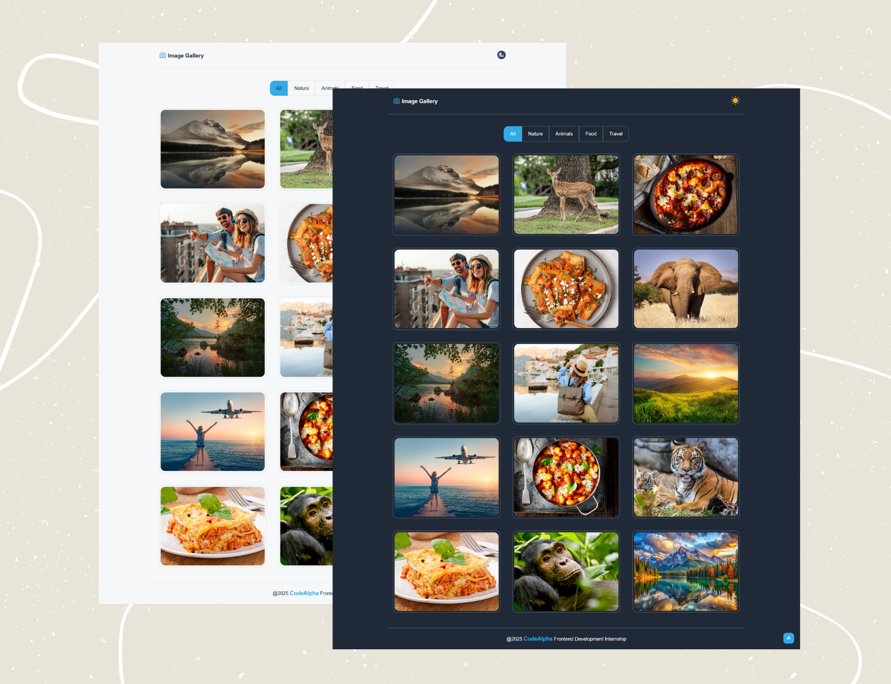

# 📸 Image Gallery

A modern and fully responsive **Image Gallery** built with **HTML, CSS, and JavaScript**.  
It includes category filtering, a light/dark mode, an interactive image viewer with navigation, and smooth animations powered by **GSAP**.

---

## 🌐 Live Demo
🔗 [View the Live Demo](https://engnada-s.github.io/CodeAlpha_Image-Gallery/)  

---

## 🚀 Features

- 🌗 **Light/Dark Mode** — persists using `localStorage`
- 🖱️ **Category Filtering** — view images by Nature, Animals, Food, or Travel
- 🔍 **Image Viewer** — open and navigate between images
- ⌨️ **Keyboard Shortcuts** — use ⬅️ ➡️ to navigate and `Esc` to close
- ⏫ **Scroll To Top** button with smooth scrolling
- 🎞️ **GSAP Animations** — for smooth and engaging transitions
- 📱 **Fully Responsive** — adapts beautifully on all devices

---

## 🧩 Technologies Used

- **HTML5**
- **CSS3**
- **JavaScript (ES6)**
- **GSAP** (GreenSock Animation Platform)

---

